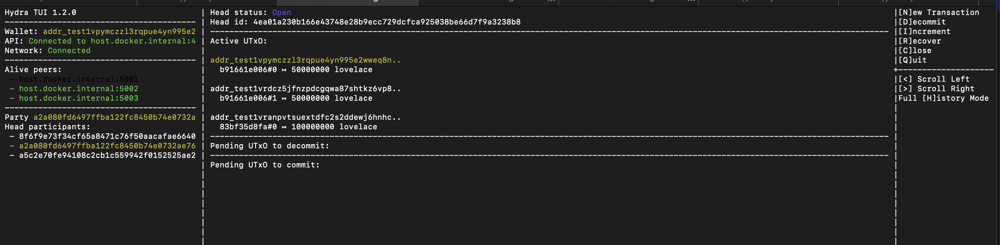

````md
# Yaci + Hydra Local Devnet (Payment Example)

This is a project for using Hydra protocols in a Yaci DevKit local network.

The Hydra node is running from a Docker image.

See the `setup-docker-hydra.sh` file for this setup. 
run this and wrapper will be generated. 
A wrapper is provided in `bin/hydra-node`.  
The same applies to `cardano-cli`; its wrapper is in `bin/cardano-cli`.  
These wrappers generate keys for all participants.

## 📚 Documentation

**📖 [View Full Documentation](https://kushal2060.github.io/hydra-yaci/)** - Complete documentation site deployed on GitHub Pages

For comprehensive documentation, see the [Documentation Directory](.github/docs/):

- **[Getting Started Guide](.github/docs/getting-started.md)** - Quick start tutorial
- **[Installation Guide](.github/docs/installation.md)** - Detailed installation instructions
- **[Configuration Guide](.github/docs/configuration.md)** - Configuration reference
- **[Usage Guide](.github/docs/usage.md)** - Complete usage documentation
- **[API Reference](.github/docs/api-reference.md)** - API documentation
- **[Troubleshooting Guide](.github/docs/troubleshooting.md)** - Common issues and solutions

---

## Prerequisites & Setup

### 1. Clone the repository
```bash
git clone https://github.com/kushal2060/hydra-yaci
cd yaci-hydra-payment
````

### 2. Install dependencies

```bash
npm install
```

### 3. Check prerequisites

Run the following command to verify all required tools and services:

```bash
npm run prerequisites
```

Expected output:

```
✓ node is installed
  Version: v20.x.x
✓ npm is installed
✓ curl is installed
✓ jq is installed
✓ docker is installed
✓ Yaci DevKit is running
  Current Epoch: 0
✓ Port 4001 is available
✓ Port 4002 is available
... (all ports check)
✓ All prerequisites met!
```

### 4. Start Yaci DevKit (if not running)

In a separate terminal:

```bash
devkit start
```

### 5. Environment configuration

Use the provided `.env.example` file as a template and configure your `.env`.

---

## Project Initialization

### 6. Setup project

```bash
npm run setup
```

Most likely, binary downloads will occur.
On macOS or Windows, you may encounter issues where the binary is for Linux only.
If that happens, simply use the Docker images as mentioned earlier.
There is no need to use the downloaded binary files.

---

## Verify Yaci Connection

### 7. Test Yaci DevKit connectivity

```bash
npm run example:status
```

Expected output:

```
Connecting to Yaci DevKit...
✓ Yaci DevKit is running!

Blockchain Information:
  Current Epoch: 0
  Blocks: 45
  Transactions: 0

Latest Block:
  Block Number: 45
  Block Hash: abcd1234...
  Time: 2024-01-15T10:30:00Z

Network:
  Network Magic: 42
  Network ID: 0

✓ All checks passed!
```

---

## Key Generation

### 8. Generate participant keys

```bash
npm run keys:generate
```

This uses `cardano-cli` via Docker and runs quickly.

Sample output:

```
Generating keys for alice...
  - Generating Hydra protocol keys...
  - Generating Cardano payment keys...
  - Generating Cardano address...
  ✓ Address: addr_test1vq2kn...
  ✓ Keys generated for alice

... (same for bob and carol)

Generated keys for:
  alice: addr_test1vq2kn...
  bob: addr_test1vr8hx...
  carol: addr_test1vs9mp...
```

---

## Funding Wallets

### 9. Fund participant addresses

```bash
npm run wallets:fund
```

If addresses are not funded:

* Go to the Yaci CLI and run:

  ```
  topup <address> <amount>
  ```
* After starting DevKit, you should also run:

  ```
  create-node -o --start
  ```

Refer to Yaci DevKit documentation for more details:
[https://devkit.yaci.xyz/commands](https://devkit.yaci.xyz/commands)

---

Also you have to publish scripts in yaci so do 
```bash
yaci-hydra % ./bin/hydra-node publish-scripts \
  --testnet-magic 42 \
  --node-socket /clusters/nodes/default/node/node.sock \
  --cardano-signing-key hydra-nodes/alice/keys/cardano.sk
```
this will give three hashed paste those with commas in .env for HYDRA_SCRIPTS_TX_ID=paste here

## Start Hydra Nodes

### 10. Start Hydra

```bash
npm run hydra:start
```

This will start the Hydra nodes.

Three Docker containers should start, exposing ports:

* 4001
* 4002
* 4003

---

## Hydra TUI

### 11. Run Hydra TUI

```bash
docker run --rm -it \
  --name hydra-tui-alice \
  -v "$PWD/hydra-nodes:/app/hydra-nodes" \
  --platform linux/amd64 \
  ghcr.io/cardano-scaling/hydra-tui:1.2.0 \
  --connect host.docker.internal:4001 \
  --cardano-signing-key /app/hydra-nodes/bob/keys/cardano.sk \
  --testnet-magic 42
```

**Change ports and container names for each participant.**

You should see a screen similar to the following:



If the network shows **disconnected**, verify that all required ports are open and listening.

After this, you can start transactions from the TUI.

---

## Debugging

### WebSocket Debug

For detailed debugging, use:

```
ws://localhost:4003
```

in Postman or any WebSocket client.

You should see the following as the first log:

```json
{
  "env": {
    "configuredPeers": "host.docker.internal:5003=http://host.docker.internal:5003,host.docker.internal:5001=http://host.docker.internal:5001,host.docker.internal:5002=http://host.docker.internal:5002",
    "contestationPeriod": 600,
    "depositPeriod": 3600,
    "otherParties": [
      { "vkey": "a2a080fd6497ffba122fc8450b74e0732ae760952d52d3be144469472ee231fc" },
      { "vkey": "8f6f9e73f34cf65a8471c76f50aacafae66401a6fab3bd918fc67a7de8b43df1" }
    ],
    "participants": [
      "fb30b170e64cb6a70a829adcba5abcef86af4d9e60e329bbcb298901",
      "49bc085f88c01e66a4994b4ca9cec80f37d8dff9a7891a2cdfcbbce5",
      "db8152499882dc200ee9fd0baec2d3027392afbebb3eaf3fb2a6088c"
    ],
    "party": {
      "vkey": "a5c2e70fe94108c2cb1c559942f0152525ae2350f6dc7ce631b3c5313aff7932"
    },
    "signingKey": "806776ded6d210aaf05ab6d1d81b3024f121bc0caf3194eb1231a6d6ed703bce"
  },
  "headStatus": "Initializing",
  "hydraHeadId": "4ea01a230b166e43748e28b9ecc729dcfca925038be66d7f9a3238b8",
  "hydraNodeVersion": "1.2.0-d967d641c0ccad884aff6187b4d1d6c8d92380dc",
  "me": {
    "vkey": "a5c2e70fe94108c2cb1c559942f0152525ae2350f6dc7ce631b3c5313aff7932"
  },
  "networkInfo": {
    "networkConnected": true,
    "peersInfo": {
      "host.docker.internal:5001": true,
      "host.docker.internal:5002": true
    }
  },
  "snapshotUtxo": {},
  "tag": "Greetings"
}
```

---

## 📖 Further Reading

For more detailed information, check out the comprehensive documentation:

- **🌐 [Documentation Website](https://kushal2060.github.io/hydra-yaci/)** - Full documentation site (GitHub Pages)
- **[Complete Documentation Index](.github/docs/index.md)** - Full documentation hub
- **[Getting Started](.github/docs/getting-started.md)** - Beginner's guide
- **[Troubleshooting](.github/docs/troubleshooting.md)** - Fix common issues
- **[API Reference](.github/docs/api-reference.md)** - Complete API documentation

## 🤝 Contributing

Contributions are welcome! Please feel free to submit a Pull Request.

## 📄 License

This project is licensed under the MIT License.

## 👤 Author

**Kushal Acharya** :)

## 🙏 Acknowledgments

- [Cardano Scaling](https://github.com/cardano-scaling) - Hydra protocol
- [Yaci DevKit](https://devkit.yaci.xyz/) - Local development network
- [Lucid Evolution](https://github.com/lucid-evolution) - Cardano library
```
